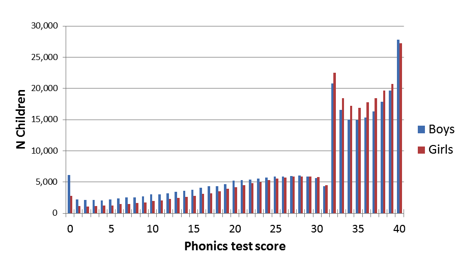

<!-- Dorothy: I wonder if we should move this chapter ahead of RCTs? It is much simpler-->
<!--DB: I did wonder about that - but I've kept it where it is as it does refer back to the previous chapter and it may not be simple to keep track when rewording. Also, it can be nice to have an easy chapter after a challenging one-->

# The experimenter as a source of bias

We have discussed numerous sources of bias that can occur in a study: systematic changes over time, use of inadequate measures, and inappropriate intervention groups. We now come to consider one further important factor: the experimenter.

The role of the experimenter was already alluded to in Chapter 6, where it was noted that some kinds of randomisation are problematic because they give the experimenter wiggle room to omit or include participants. You might imagine that no honest person would distort their study this way, but it is all too easy to provide a post hoc rationalisation for such decision, or to be influenced by unconscious biases. Imagine you have planned a study of your favourite comprehension intervention, and you visit a school which is helping recruit children for the study. As you chat to the children in their classroom, you see that one little boy who met criteria for the study is highly overactive and seems unable to concentrate for more than a minute or two on anything. If you had control over intervention assignment, there might be a strong temptation to  allocate him to the control group! Or you might rethink the study criteria and decide that you should exclude highly inattentive children. These kinds of reactions are understandable but they create bias in the results.  

## Allocation concealment

This brings us to the topic of masking, or allocation concealment about intervention status from the experimenter. Traditionally, the term 'blinding' has been used, but this can be offensive to some visually impaired people, so we will avoid it here. Nevertheless, you will hear the term in the context of the 'double blind trial'. This refers to the situation when the neither the experimenter nor the participants are aware of who is in the active or the control group. As noted in chapter 4, it is not always feasible to keep people unaware of whether they are in an active intervention or control group, though use of active controls, as described in Chapter 5, may allow for this.  

In speech and language therapy practice, where resources are limited and the same person may be conducting the study and administering the intervention, particular care needs to be given to masking. A competent third party should be recruited to be responsible for allocation to intervention groups, but this is not all. It is also important to take steps to avoid experimenter bias in administration of baseline and outcome assessments. 

## The importance of masking for assessments

As discussed in Chapter 2, some assessments are more objective than others: it is relatively easy to be swayed by one's own desires and expectation when making a global rating of a person's communicative competence on a 4-point scale, much less so when administering a multiple choice comprehension test, where the task is to select a pictures to match a spoken word. Nevertheless, there is evidence that, even with relatively objective tasks, experimenter bias can creep in. Perhaps the clearest evidence comes from reviews that compare similar experiments that are administered either with or without masking: where experimenters are unaware of which group a subject is in, effects are typically smaller than when they are aware (and hence potentially able to bias the observations) (@holman2015).

Perhaps the most sobering example comes, not from an intervention study, but from data on a phonics screening test administered by teachers in UK schools in 2012. The score is supposed to just indicate the number of items on a standard list of words and nonwords that a child reads accurately. Although there is some leeway in judging whether a nonword is correctly pronounced, this should not be expected to exert a big effect on final scores, given that teachers are provided with a list of acceptable pronunciations. The results, however, which are published annually on a government website, showed clear evidence of scores being nudged up for some cases. We would expect a normal distribution of scores, but instead there was a sudden dip just below the pass mark and a corresponding excess of cases just about the pass mark. Since teachers were aware of the pass mark, they would have been able to nudge up the scores of children who were just one or two points below, and the distribution of scores is clear evidence that this happened. A similar picture was observed in 2013 (http://deevybee.blogspot.com/2013/10/good-and-bad-news-on-phonics-screen.html, but the spike disappeared in 2014, when teachers were not told the pass mark in advance (@duff2015).

]

We don't usually think of teachers as dishonest or fraudulent. Some were opposed in principle to the phonics check and may have felt justified in not taking it seriously, but I suspect that most were doing their sincere best, but just did not think a slight tweak of a child's results would matter. There are anecdotal reports of teachers being unwilling to categorise children as "failing" at such a young age. And some may have been concerned that their personal reputation or that of their school might be damaged if too many children "failed". The possible reasons for nudging are many, and cannot be established post hoc, but the point we want to stress is that this kind of behaviour is very common, often not done in a deliberately dishonest fashion, but is something that will happen if people are motivated to get one result or another.

In medical trials, the large amount of evidence for experimenter bias on measures has led to a general consensus that outcome assessments should be done by someone who is unaware of who was in the intervention or control group. This is likely to add to the cost of conducting a trial, but it gives security that no nudging has taken place.

<!---START CUSTOM BLOCK-->
**Another questionable classic study**
When experimenter bias is discussed, we usually see citation to the work of Robert Rosenthal, who conducted a series of experiments in the 1960s, some of which have become classics in psychology. One of the most famous, which features in many undergraduate texts, is a study by Rosenthal & Fode, (@rosenthal1963), which describes how student experimenters could be made to give biased evaluation of performance of rats in maze-learning task. All the rats were from the same batch, but students were told they were either "maze bright" or "maze dull". Since there was no real difference between rats, they should have performed the same, but those designated as "maze bright" were faster in solving the maze than the "maze dull".  
Unfortunately, this classic study does not stand up to scrutiny. The numbers of students were small, and the results were not statistically robust when analysed according to contemporary standards. Indeed, even at the time, Rosenthal's work on experimenter bias came under strong criticism for methodological flaws (@barber1968). Nevertheless, Rosenthal's account of experimenter bias has been highly influential, forming part of the canon of "zombie psychological effects" that refuse to die, while Barber's critique has been largely forgotten. As with the Hawthorne effect, we see that few people return to look at the original data, and even if the research is debunked, it lives on because the story is just too perfect.  
Does this mean we do not need to worry about experimenter effects? We recommend that it is good practice to take them into account when designing studies, but this story is further evidence of the need to look carefully at supposedly well-established findings. 

<!---END CUSTOM BLOCK-->

## Conflict of interest 

Many medical journals, and increasingly journals in other fields, require authors to declare conflicts of interest, and a statement to this effect will be included with the published paper. @Lo_2009 define conflict of interest (COI) as:  
_"a set of circumstances that creates a risk that professional judgement or actions regarding a primary interest will be unduly influenced by a secondary interest”._  
Typically, people think of COI as involving money. Someone who is marketing a computerised intervention, for instance, will be motivated to show it is effective – their business and livelihood would collapse if it was widely known to be useless. But COI – also sometimes referred to as 'competing interests' – extend beyond the realms of finance.  
-	A researcher's reputation may depend heavily on their invention of an intervention approach.  
-	A therapist may be aware of threats to cut government-funded services unless intervention is shown to be effective.  

For those in vocational professions such as therapy or teaching, relatively poor working conditions may be endured in return for a sense of doing good. An intervention study with null results can be hard to accept if it means that the value of one's daily work is challenged. 

In effect, most people involved in intervention studies want to show a positive effect for one reason or another. It's not generally possible to avoid all conflict of interest, but the important thing is to recognise experimenter bias as the rule rather than the exception, identify possible threats this poses to study validity,  take stringent steps to counteract these, and report openly any conflict of interest.  We discussed above the ways in which results on outcome measures may be nudged up or down, often without any conscious attempt to mislead. But the impact of experimenter bias can occur at all stages of an intervention study:  

-	At the stage of study design, the researcher may argue against including a control group – claiming ethical objections – because they are aware that it is much easier to show apparent intervention effects when there are no controls (see Chapter 5).  
-	In a controlled study, when allocating participants to intervention or control groups, the researcher may change inclusion criteria as the study progresses.  
-	Allocation to intervention or control groups may be under the control of a researcher who does not adopt truly random methods, and so can determine who is in which group. Chapter 6 explains how randomisation can overcome this.  
-	As noted above, if the person doing baseline and outcome assessments knows which intervention group a participant is in, then scores may be nudged. This can be avoided by having assessments done by someone who is unaware of who got the intervention.  
-	When it comes to analysing the data, the researcher may decide on which variables to report, depending on the results. We discuss this problem and how to counteract it in Chapter x.  
-	If the pattern of results does not show that the intervention is effective, then further checks and alternative analyses are conducted, whereas positive results are accepted without additional scrutiny.  
-	If the trial gives disappointing results, then the decision may be made not to report them. See Chapters 11 and 19 for discussion of this problem and suggestions for avoiding it.  

The important point to recognise is that being a good scientist often conflicts with our natural human tendencies (@bishop2020). A good scientist is always objective, and interpretation of results should not be swayed by personal likes and dislikes. On getting a positive intervention result, a good scientist will immediately ask: "Were there biases in my study that could have contributed to this finding?" – and indeed will not take offence if other scientists identify such factors. We need, of course, arguments in the opposite direction: a failure to see an intervention effect doesn't necessarily mean the intervention did not work – there could be aspects of study design that hide true effects, including too small a sample (see Chapter 9). Our experience at conferences where people discuss intervention studies is that the question session is always dominated by people presenting arguments about why a null result may be misleading, but it is much rarer to hear people questioning the validity of a positive result. It is a human tendency to accept information that fits with our desires and prejudices (in this case, that intervention is effective) and to reject contrary evidence. It also goes against our human nature to be critical of an intervention study conducted by a well-intentioned person who has put in a great deal of time and effort. But at the end of the day it is the quality of the evidence, rather than the feelings of researchers, that must take priority. Currently, we still know rather little about how best to help children and adults who struggle with speech, language and communication. We will only change that if we take a rigorous and evidence-based approach to evaluating evidence.  

## Class exercise

Once again, you need to find a published intervention study – this could be one you selected for a previous exercise, or a new one.  
-	Does the published paper include a 'conflict of interest' or 'competing interests' statement?  
-	List the possible factors that might lead the experimenter to be biased in favour of finding a positive result.  
-	Consider the list of stages in the research process where experimenter bias could affect results: How have the researchers counteracted these?  
