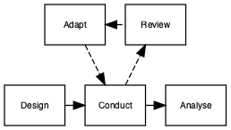
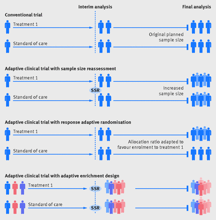

# Adaptive Interventions

```{r packages16, echo=F, message=F, warning=F}
list_of_packages<-c("tidyverse","diagram","ggpubr","ggalluvial","DiagrammeR","DiagrammeRsvg","rsvg", "knitr", "kableExtra")
new.packages <- list_of_packages[!(list_of_packages %in% installed.packages()[,"Package"])]
if(length(new.packages))install.packages(new.packages,dependencies = TRUE)

library(tidyverse)
library(ggpubr)
library(ggalluvial)
library(diagram)

library(DiagrammeR)
library(DiagrammeRsvg)
library(magrittr)
library(rsvg)

library(kableExtra)
library(knitr)
library(citr)
```

Suppose we have two potential school-based reading interventions for dyslexic children aged 9-11, one computer game based and one phonics-based. The lead researcher wishes to test both interventions but has limitations on funding, so can only run one trial rather than two independent trials. The researcher also has some idea that the phonics-based intervention is more likely to be effective than the other. There is a substantial body of literature highllighting significant effect of the phonics intervention but in younger typically developing children, whereas the computer game intervention is novel and relatively untested.

A trial design is proposed that allows both interventions to be run in parallel with the addition of a control group for reference (receive usual planned teaching), this is known as a three-arm trial (two interventions and a control). The researcher now has a futher design decision to make, traditional fixed design or an adaptive trial. 

A traditional randomised control trial (without adaption) requires that data are not analysed or 'looked at' before data collection is completed. Sample size is calculated to ensure a well power study given certain assumptions about effect size of interest, type I error rate and power required. The analysis is performed after data collection is complete and results reported. The adaptive trial has the benefit that the intervention can be assessed at multiple points during the recruitment phase of the trial without biasing the results, hence we can make certain adjustments in light of this information.

If we return to our three-arm trial for reading and phonics interventions. The researcher has started data collection and has gathered some initial teacher feedback that the novel computer game intervention seems to be hampering progress in those individuals. Being a good researcher, in a traditional trial there would be no other course of action but to let the trial run its course and evaluate as planned. This might lead to the computer intervention showing poor results or even having a negative impact on those individuals, confirming the teacher's concerns. Alternatively, if the researcher had chosen an adaptive design the teacher's observations could have been assessed part way through the trial and the computer based intervention dropped from the study if interim analyses showed a negative impact of the intervention. As a consequence, the remaining individuals could change onto the phonics based intervention if the interim analyses showed positive results.  

```{r flow1, echo=FALSE, include=TRUE,echo=F,message=F,warning=F}

tes1<-DiagrammeR::grViz("
digraph rmarkdown {

node [shape = rectangle,
      fontname = Helvetica,fontsize=8]
      
      Review [label='Review']
      Design1 [label = 'Design']
      Analyse1 [label = 'Analyse']
      Adapt [label = 'Adapt']
      Conduct1 [label = 'Conduct']

Adapt -> Conduct1 [style=dashed]
Conduct1 -> Review [style=dashed]
{rank=same; Design1 -> Conduct1 -> Analyse1};
{rank=same; Adapt -> Review[dir=back,style=dashed]};

}
", height=200)

tes1 %>%export_svg %>% charToRaw %>% rsvg_png("flow_16_1.png")

```



The adaptive design, as the name suggests, allows for modifications to certain aspects of the design as the trial progresses [see Figure 16.1, taken from @pallman_2018]. The assessment of whether modifications are required are typically referred to as interim analyses. These pre-planned assessments can be used to make several pre-specified changes, if required. Figure 16.2 [from @Thorlund_2018] shows some of the commonly used adaptive trial designs, other include: changing the amount or frequency of intervention received, and stopping intervention early if not effective or adverse effects observed.



  


## More niche trial designs

### Just-in-Time adaptive interventions (JITAI)

### Micro-Randomized Trials (MRT)

### Sequential, Multiple Assignment, Randomized Trial (SMART)