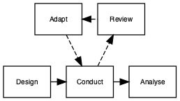
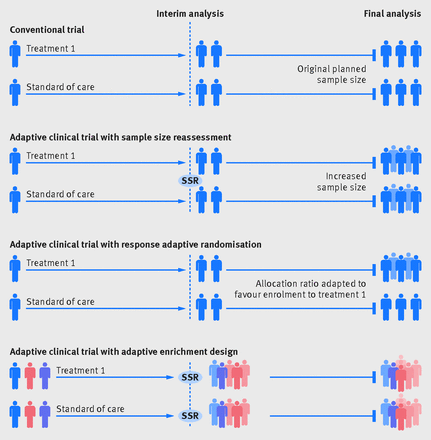

# Adaptive Interventions

```{r packages16, echo=F, message=F, warning=F}
list_of_packages<-c("tidyverse","diagram","ggpubr","ggalluvial","DiagrammeR","DiagrammeRsvg","rsvg", "knitr", "kableExtra")
new.packages <- list_of_packages[!(list_of_packages %in% installed.packages()[,"Package"])]
if(length(new.packages))install.packages(new.packages,dependencies = TRUE)

library(tidyverse)
library(ggpubr)
library(ggalluvial)
library(diagram)

library(DiagrammeR)
library(DiagrammeRsvg)
library(magrittr)
library(rsvg)

library(kableExtra)
library(knitr)
library(citr)
```

A traditional randomised control trial (without adaption) requires that data are not analysed or 'looked at' before data collection is completed. The potential drawback of the traditional design is that this may not be optimal. The adaptive trial has the benefit that the intervention can be assessed at multiple points during the recruitment phase of the trial without biasing the results.  

```{r flow1, echo=FALSE, include=TRUE,echo=F,message=F,warning=F}

tes1<-DiagrammeR::grViz("
digraph rmarkdown {

node [shape = rectangle,
      fontname = Helvetica,fontsize=8]
      
      Review [label='Review']
      Design1 [label = 'Design']
      Analyse1 [label = 'Analyse']
      Adapt [label = 'Adapt']
      Conduct1 [label = 'Conduct']

Adapt -> Conduct1 [style=dashed]
Conduct1 -> Review [style=dashed]
{rank=same; Design1 -> Conduct1 -> Analyse1};
{rank=same; Adapt -> Review[dir=back,style=dashed]};

}
", height=200)

tes1 %>%export_svg %>% charToRaw %>% rsvg_png("flow_16_1.png")

```



The adaptive design, as the name suggests, allows for modifications to certain aspects of the design as the trial progresses [see Figure 16.1, taken from @pallman_2018]. The assessment of whether modifications are required are typically referred to as interim analyses. These pre-planned assessments can be used to make several pre-specified changes, if required. Figure 16.2 [from @Thorlund_2018] shows some of the commonly used adaptive trial designs, other include: changing the amount or frequency of intervention received, and stopping intervention early if not effective or adverse effects observed.



Suppose we have two potential school based interventions, one reading-based and one phonics-based. The lead researcher wishes to test both interventions but has limitations on funding, so can only run one trial rather than two independent trials. A trial design is proposed that allows both interventions to be run in parallel with the addition of a control group for reference (receive usual planned teaching), this is known as a two arm trial.  


## More niche trial designs

### Just-in-Time adpative interventions (JITAI)

### Micro-Randomized Trials (MRT)

### Sequential, Multiple Assignment, Randomized Trial (SMART)