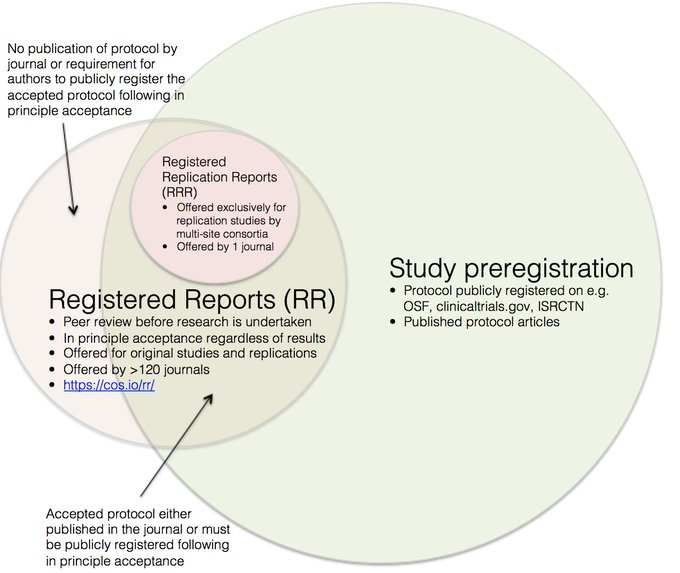
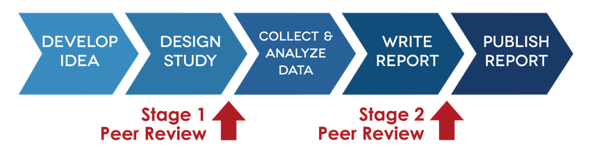

#	Pre-registration and Registered Reports

When pre-registration is discussed in the broader scientific literature, the specificity of the terminology can be quite opaque. Here we make the clear distinction between pre-registration and registered reports as these are often used interchangeably. Professor Chris Chambers has produced the useful Venn diagram [Figure 1,  see @Chambers_2018] that aids the distinction between pre-registration and registered reports.

## What do we mean by Pre-registration?

Pre-registration is the process of writing down any formal hypothese(s), as a minimum, prior to collecting and analysing study data. This gives the clear distinction that pre-registration is not an exploratory framework and is uniquely for confirmatory research. 

**INSERT: Sensible example of a project that could be preregistered**

Examples of pre-registration templates are available [https://cos.io/rr/](https://cos.io/rr/)

The idea of pre-registration was to overcome two problems in scientific publishing [@Bishop_2013]:

 - Bias against publication of null results or negative findings (results-driven publication decisions),
 - A failure to distinguish hypothesis-generating (exploratory) from hypothesis-testing analyses.
 
## What is a Registered Report?

Registered reports are specific type of journal article that embraces pre-registration as one element of the process and peer review is crucially before data is collected. This unique format turns the traditional publishing paradigm on its head. Peer review can be viewed less as 'here's what you got wrong and should have done' and more like a helpful co-author that gives feedback at a stage in the project that things can be adapted to improve the study. In addition, registered reports also require some other detail including: specification of the analysis plan, power or sample size analysis, and distinction of exploratory analyses from pre-registered analyses. 

Figure X [see @Chambers_2018] shows the workflow of the typical research article and highlights the points at which reviews are conducted. A stage 1 review occurs once the study has been designed and statistical analysis plan devised. After this review, an in principle acceptance can be offered which crucially is results free, i.e. publication is guaranteed regardless of the result and provided that the authors perform the analysis as planned or transparently document any deviations from the planned design. A second stage review is then conducted but this is much lighter touch and only check whether the authors did as they had said they would and any claims have not been inflated. 

 
