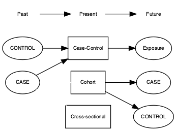

---
output:
  pdf_document: default
  html_document: default
---
# (PART) Observational {-}

# Observational studies

> *Janice, a SLT, has recently started using a parent-based approach with late-talking 2-year-olds in her practice. Parents are encouraged to make video recordings of interactions with their child, which are then analysed with the therapist, who notes ways of making the interaction more contingent on the child's interests and communicative attempts. She wants to evaluate what she is doing. A colleague of hers, Anna, who has a similar caseload,  is sceptical about whether Janice's approach is cost-effective. Anna uses a watchful waiting approach with children this young. Janice and Anna agree to do a study using the same pre- and post-intervention assessments so that they can evaluate the impact of Janice's approach.*

>*Stephen notes that some aphasic patients referred to his clinic talk glowingly about a commercially available 'brain-based learning' programme, MyLangBooster. He wants to know whether he should be recommending this programme to other clients, so he carries out a comparison of patients who used MyLangBooster and those who did not.*

>*Dorothy, a researcher, had a grant for a study predicting outcomes of 4-year-olds who had poor language skills, some of whom had received intervention with SLT services. She saw the same group of 83 children at ages 4, 4.5 and 5.5 years, and noted that their outcomes were very variable. Some children had caught up with their peer group by the final assessment, whereas others had persistent problems. When she presented the results at a conference, a person in the audience suggested that she should do an analysis to see if the amount of intervention was a factor influencing outcomes.*

All of these vignettes illustrate observational studies: ones where we use naturalistic data rather than exerting any experimental control over who gets an intervention. The last one, as you may have guessed, is a true story – my own experience with a longitudinal study by Bishop and Edmundson (1987). This gives a very clear illustration of the perils of observational studies.

When I looked at the relationship between intervention and outcome in my sample, I found results that were deeply depressing to SLTs: the children who had the most intervention had the worst outcomes. Did that mean that intervention was actually harming children? Well, it's possible – as noted in chapter 5, it is dangerous to assume that all effects of intervention are benign. But there was a much simpler explanation for this topsy-turvy result: the children who received intervention were different from those who didn't – in general they had more severe problems to start with. This makes sense: if a child is referred to SLT services, then the therapist makes a judgement about which ones to intervene with, and these are likely to be different from those who are discharged or simply reviewed after a few months. If, as appears to have been the case in my study in the 1980s, therapists work most with the more serious cases, then intervention may appear ineffective. On the other hand, a contemporary concern in the UK is that therapists are being encouraged to focus their efforts on children who can be discharged after a short block of treatment, which means they prefer to work with children with milder problems. This will create the opposite impression – therapy which is actually ineffective may appear effective. The basic problem is the same: treated and untreated groups are not comparable, and so comparing them will give misleading results. 

Stephen's study is equally problematic. Here we are comparing a self-selected group of patients with his regular caseload. Those who tried MyLangBooster may be more motivated to improve than other patients. They may have more money, so they can afford to pay for the programme. Or they may be more desperate – having tried other interventions that failed to make a difference.  Furthermore, Stephen may only hear from those who felt they improved, and be unaware of other patients who tried it but then dropped out because they obtained disappointing results. It is almost never a good idea to base an evaluation of an intervention on a study of self-selected enthusiasts. There are just too many potential confounds that could cause bias.

What about the case of Janice and Anna? This may seem less problematic, since the two therapists have similar caseloads, and the decision about therapy is based on therapist preference rather than child characteristics. Here again, though, the comparison has the potential to mislead. If baseline and post-intervention assessments are done using the same measures, then it is at least possible to check if the children in the two practices are similar at the outset. But there would still be concerns about possible differences between the therapists and their practices that might be influencing results. Maybe Anna rejects parent-based intervention because she knows that most of the parents in her practice have full-time jobs and would not be willing or able to devote time to attending sessions to analyse videos. Maybe Janice is an exceptionally skilled therapist who would obtain good outcomes with children regardless of what she did. Perhaps her enthusiasm for a parent-based approach contrasts with Anna's more downbeat attitude, and this has an influence on parent and/or child. In sum, there is scope for all the non-specific treatment effects discussed in Chapter 4 to exert an impact. If Janice finds better outcomes than Anna, despite doing their best to ensure that the participating children and parents from their practices are similar, then it is reasonable to say that this is useful information that would provide justification doing an experimental study (see Chapter x). But it is not conclusive and cannot substitute for the kind of experimental study discussed in the next chapter.

Things that may affect outcome and that differ between intervention and control groups are known as **confounders**. 

(\#fig:confounder)Confounder path diagram

(\#fig:confounder2)Alternative interpretation of confounder path diagram

Consider possible confounders in the following examples: Does long-term use of hormone replacement therapy carry risks or benefits? Does excessive use of computer games in teenagers cause social isolation? Will your life be extended if you eat more cabbage? Here are just a few possibilities:  Woman who decide to continue to use HRT may have more severe menopausal symptoms.  Excessive use of computer games may be a consequence rather than a cause of lack of social engagement, and those who eat cabbage may adopt healthier lifestyles than those who don't. 

Most reports in the media are based on observational rather than experimental data. In some cases, it is hard to see how other types of data could be collected: are we really going to succeed in allocating adolescents to a regime of non-stop computer games, or to force people to start eating cabbage? Indeed, some associations that are now well-established, such as the link between cigarette smoking and cancer, were discovered from observational data, and could not be studied any other way. But where the interest is in interventions administered by a therapist, then it should not be necessary to rely on observational studies, and, as we have shown, to do so can lead to flawed conclusions.

## Class exercise

Find a newspaper report of a factor that is reported to be a risk or benefit to health. Is it based on an experimental or observational study? Can you identify potential sources of bias?

## Observational study designs

The key difference between observational studies and other types discussed in this book are that the researcher(s) do not intervene at any stage, and simply observe whether a condition develops, and record any risk factors or particular behaviour(Sedgewick 2012). The difference between the designs discussed below is either the point at which the intervention or outcome are established.

### Cohort studies

A Cohort study follows a group of individuals who do not have the condition or disorder of interest at the time that they enter the study, but they are selected from an at-risk population. The cohort is followed up, observing those that develop the condition or disorder, and those that do not (forming a natural control group, sometimes called an internal control, see Mann, 2003). Within the cohort design, there are different variations, single cohort as above, or two cohort design . For example, a two cohort design would collect data on two cohorts of individuals (both groups do not have the condition at the start of the study). One cohort is assigned to intervention, the other cohort is a control so would be assigned a sham intervention perhaps. Both cohorts would be followed up and the observation of who developed the condition and who did not is recorded for both cohorts.   

### Case-Control studies

Typically, the case-control study looks at retrospective information on a group of individuals, both a control group (those without particular condition or disorder) and cases (those with a known condition or disorder). Individuals are chosen purely on their status of condition or disorder of interest. These individuals are then asked about previous exposure to potential risk factors, for example, if we were looking at a reading disorder in school-aged children, we might want to record information on family history of the condition, or exposure to books in the home environment, or whether the children and their parent or guardian co-read at home at a pre-school age. The choice of controls participants is key as they must form a representative sample of individuals that are within the at-risk group population but do not have the condition or disorder of interest. 

### Cross-Sectional Studies

The cross-sectional study is used when only one time point is recorded and its primary purpose is typically to establish prevalance of conditions or disorders. In this design, we differentiate from the others designs as the intervention and outcome are determined simultaneously (cite: Carlson & Morrrison, 2009). 

## STROBE guidelines

The strengthening the reporting of observational studies in epidemiology (STROBE) statement: guidelines for reporting observational studies was developed to try to standardize the key details reported in observational studies in epidemiology (with a focus on the medical field). These guidelines have been adopted to counter poor reporting, the authors of those guidlines state the purpose is not to be a rigid template or assessment tool, but 

>issues such as confounding, bias, and generalisability could become more transparent, which might help temper the over-enthusiastic reporting of new findings in the scientific community and popular media, and improve the methodology of studies in the long term. Better reporting may also help to have more informed decisions about when new studies are needed, and what they should address.

- Von Elm et al (2007)

The Strobe guidelines themselves consist of 22 items that are a necessary requirement to report to ensure some degree of transparency to the research, and ensure a good standard of reporting quality. We restate the STROBE guidelines from Von Elm at al. (2007) in \@ref(tab:strobe)

+---------------------------+-------------+--------------------------------+
|                           | Item number | Recommendation                 |
+===========================+=============+================================+
| TITLE and ABSTRACT        | 1           | * Indicate the study’s         |
|                           |             | design with a commonly used    |
|                           |             | term in the title or the       |
|                           |             | abstract                       |
|                           |             | * Provide in the abstract an   |
|                           |             | informative and balanced       |
|                           |             | summary of what was done and   |
|                           |             | what was found                 |
+---------------------------+-------------+--------------------------------+
| Background/rationale      | 2           | Explain the scientific         |
|                           |             | background and rationale for   |
|                           |             | the investigation being        |
|                           |             | reported                       |
+---------------------------+-------------+--------------------------------+
| Objectives                | 3           | State specific objectives,     |
|                           |             | including any prespecified     |
|                           |             | hypotheses                     |
+---------------------------+-------------+--------------------------------+
| Study design              | 4           | Present key elements of study  |
|                           |             | design early in the paper      |
+---------------------------+-------------+--------------------------------+
| Setting                   | 5           | Describe the setting,          |
|                           |             | locations, and relevant dates, |
|                           |             | including periods of           |
|                           |             | recruitment, exposure,         |
|                           |             | follow-up, and data collection |
+---------------------------+-------------+--------------------------------+
| Participants              | 6           | * Cohort study—Give the        |
|                           |             | eligibility criteria, and the  |
|                           |             | sources and methods of         |
|                           |             | selection of participants.     |
|                           |             | Describe methods of follow-up  |
|                           |             | Case-control study—Give the    |
|                           |             | eligibility criteria, and the  |
|                           |             | sources and methods of case    |
|                           |             | ascertainment and control      |
|                           |             | selection. Give the rationale  |
|                           |             | for the choice of cases and    |
|                           |             | controls                       |
|                           |             | Cross-sectional study—Give     |
|                           |             | the eligibility criteria, and  |
|                           |             | the sources and methods of     |
|                           |             | selection of participants      |
|                           |             | * Cohort study—For matched     |
|                           |             | studies, give matching         |
|                           |             | criteria and number of exposed |
|                           |             | and unexposed                  |
|                           |             | Case-control study—For         |
|                           |             | matched studies, give matching |
|                           |             | criteria and the number of     |
|                           |             | controls per case              |
+---------------------------+-------------+--------------------------------+
| Variables                 | 7           | Clearly define all outcomes,   |
|                           |             | exposures, predictors,         |
|                           |             | potential confounders, and     |
|                           |             | effect modifiers. Give         |
|                           |             | diagnostic criteria, if        |
|                           |             | applicable                     |
+---------------------------+-------------+--------------------------------+
| Data sources/ measurement | 8           | For each variable of interest, |
|                           |             | give sources of data and       |
|                           |             | details of methods of          |
|                           |             | assessment (measurement).      |
|                           |             | Describe comparability of      |
|                           |             | assessment methods if there is |
|                           |             | more than one group            |
+---------------------------+-------------+--------------------------------+
| Bias                      | 9           | Describe any efforts to        |
|                           |             | address potential sources of   |
|                           |             | bias                           |
+---------------------------+-------------+--------------------------------+
| Study size                | 10          | Explain how the study size was |
|                           |             | arrived at                     |
+---------------------------+-------------+--------------------------------+
| Quantitative variables    | 11          | Explain how quantitative       |
|                           |             | variables were handled in the  |
|                           |             | analyses. If applicable,       |
|                           |             | describe which groupings were  |
|                           |             | chosen, and why                |
+---------------------------+-------------+--------------------------------+
| Statistical methods       | 12          | * Describe all statistical     |
|                           |             | methods, including those used  |
|                           |             | to control for confounding     |
|                           |             | * Describe any methods used to |
|                           |             | examine subgroups and          |
|                           |             | interactions                   |
|                           |             | * Explain how missing data     |
|                           |             | were addressed                 |
|                           |             | * Cohort study—If              |
|                           |             | applicable, explain how loss   |
|                           |             | to follow-up was addressed     |
|                           |             | Case-control study — If        |
|                           |             | applicable, explain how        |
|                           |             | matching of cases and controls |
|                           |             | was addressed                  |
|                           |             | Cross-sectional study — If     |
|                           |             | applicable, describe           |
|                           |             | analytical methods taking      |
|                           |             | account of sampling strategy   |
|                           |             | * Describe any sensitivity     |
|                           |             | analyses                       |
+---------------------------+-------------+--------------------------------+
| Participants              | 13          | * Report the numbers of        |
|                           |             | individuals at each stage of   |
|                           |             | the study—e.g., numbers        |
|                           |             | potentially eligible, examined |
|                           |             | for eligibility, confirmed     |
|                           |             | eligible, included in the      |
|                           |             | study, completing follow-up,   |
|                           |             | and analysed                   |
|                           |             | * Give reasons for             |
|                           |             | non-participation at each      |
|                           |             | stage                          |
|                           |             | * Consider use of a flow       |
|                           |             | diagram                        |
+---------------------------+-------------+--------------------------------+
| Descriptive data          | 14          | * Give characteristics of      |
|                           |             | study participants (e.g.,      |
|                           |             | demographic, clinical, social) |
|                           |             | and information on exposures   |
|                           |             | and potential confounders      |
|                           |             | * Indicate the number of       |
|                           |             | participants with missing data |
|                           |             | for each variable of interest  |
|                           |             | * Cohort study—Summarise       |
|                           |             | follow-up time (e.g., average  |
|                           |             | and total amount)              |
+---------------------------+-------------+--------------------------------+
| Outcome data              | 15          | Cohort study—Report numbers    |
|                           |             | of outcome events or summary   |
|                           |             | measures over time             |
|                           |             | Case-control study—Report      |
|                           |             | numbers in each exposure       |
|                           |             | category, or summary measures  |
|                           |             | of exposure                    |
|                           |             | Cross-sectional study—Report   |
|                           |             | numbers of outcome events or   |
|                           |             | summary measures               |
+---------------------------+-------------+--------------------------------+
| Main results              | 16          | * Give unadjusted estimates    |
|                           |             | and, if applicable,            |
|                           |             | confounder-adjusted estimates  |
|                           |             | and their precision (e.g., 95% |
|                           |             | confidence interval).          |
|                           |             | Make clear which confounders   |
|                           |             | were adjusted for and why they |
|                           |             | were included                  |
|                           |             | * Report category boundaries   |
|                           |             | when continuous variables were |
|                           |             | categorized                    |
|                           |             | * If relevant, consider        |
|                           |             | translating estimates of       |
|                           |             | relative risk into absolute    |
|                           |             | risk for a meaningful time     |
|                           |             | period                         |
+---------------------------+-------------+--------------------------------+
| Other analyses            | 17          | Report other analyses          |
|                           |             | done—e.g., analyses of         |
|                           |             | subgroups and interactions,    |
|                           |             | and sensitivity analyses       |
+---------------------------+-------------+--------------------------------+
| Key results               | 18          | Summarise key results with     |
|                           |             | reference to study objectives  |
+---------------------------+-------------+--------------------------------+
| Limitations               | 19          | Discuss limitations of the     |
|                           |             | study, taking into account     |
|                           |             | sources of potential bias or   |
|                           |             | imprecision. Discuss both      |
|                           |             | direction and magnitude        |
|                           |             | of any potential bias          |
+---------------------------+-------------+--------------------------------+
| Interpretation            | 20          | Give a cautious overall        |
|                           |             | interpretation of results      |
|                           |             | considering objectives,        |
|                           |             | limitations, multiplicity of   |
|                           |             | analyses, results from similar |
|                           |             | studies, and other relevant    |
|                           |             | evidence                       |
+---------------------------+-------------+--------------------------------+
| Generalisability          | 21          | Discuss the generalisability   |
|                           |             | (external validity) of the     |
|                           |             | study results                  |
+---------------------------+-------------+--------------------------------+
| Funding                   | 22          | Give the source of funding and |
|                           |             | the role of the funders for    |
|                           |             | the present study and, if      |
|                           |             | applicable, for the original   |
|                           |             | study on which the present     |
|                           |             | article is based               |
+---------------------------+-------------+--------------------------------+

The guidelines follow the structure of a typical research article, breaking down the required elements under subheadings that are compatable to most journals reporting observational research.

## Matching

### Propensity score

### distance matrices

### Optimal matching
