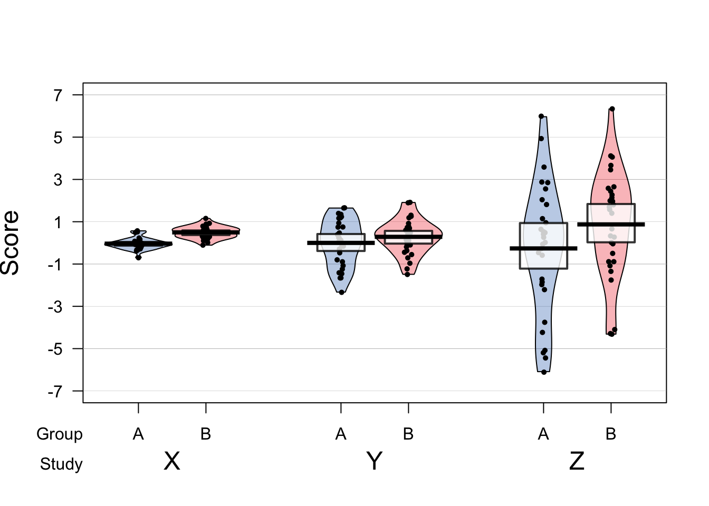
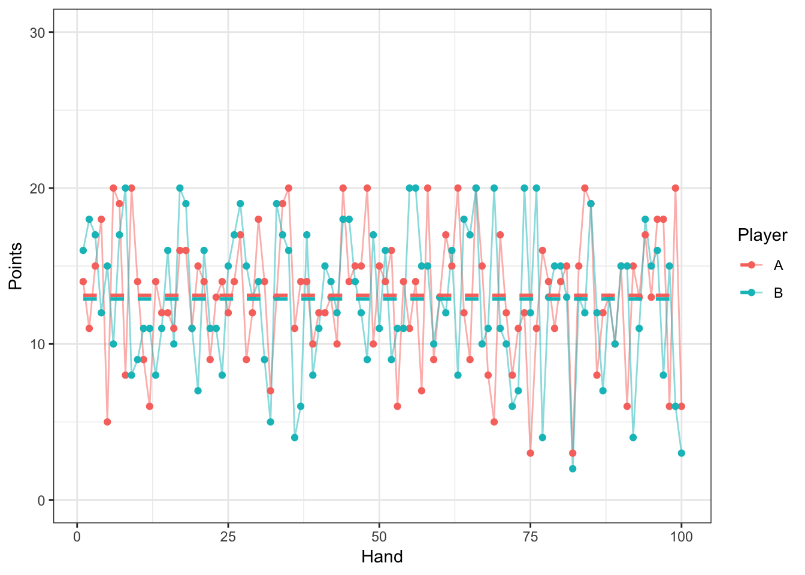

# (PART) Experimental Studies {-}

# Putting it all together: the randomised controlled trial

The randomised controlled trial (RCT) is regarded by many as the gold standard method for evaluating interventions. In later chapters we will discuss some of the limitations of this approach that may make it less than ideal for evaluating SLT interventions. But in this chapter we'll look at the ingredients of a RCT that make it such a well-regarded method, and introduce the basic statistics that are used to analyse the results.

A RCT is effective simply because it is designed to reduce many of the systematic biases that were covered in previous chapters. The inclusion of a control group ensures that we can distinguish genuine differences in outcome linked to the intervention from other reasons for change over time (Chapter x). Randomisation of participants to intervention and control groups avoids bias caused either by participants' self-selection of intervention group, or experimenters' determining who gets what treatment.  In addition, as noted in Chapter x, where feasible, both participants and experimenters may be kept unaware of who is in which treatment group, giving a double-blind RCT.

RCTs have become such a bedrock of medical research that standards for reporting them have been developed. In Chapter x we saw the CONSORT flowchart, which is a useful way of documenting the flow of participant through a trial. CONSORT stands for Consolidated Standards of Reporting Trials, which are endorsed by many medical journals. Indeed, if you plan to publish an intervention study in one of those journals, you are likely to be required to show you have followed the guidelines. The relevant information is available on the 'Enhancing the QUAlity and Transparency Of health Research' [EQUATOR](http://www.equator-network.org) network website. The EQUATOR network site covers not only RCTs but also the full spectrum guidelines of most types of clinical research designs. 

For someone starting out planning a trial, it is worth reading the CONSORT Explanation and Elaboration document [@Moher_2010], which gives the rationale behind different aspects of the CONSORT guidelines. This may seem rather daunting to beginners, as it mentions more complex trial designs as well as a standard RCT comparing intervention and control groups and assumes a degree of statistical expertise (see below). It is nevertheless worth studying, as adherence to CONSORT guidelines is seen as a marker of study quality, and it is much easier to conform to their recommendations if a study is planned with the guidelines in mind, rather than if the guidelines are only consulted after the study is done.

## Statistical analysis of a RCT

Many of those who train as SLTs or other allied health professions get little or no statistical training. This is unfortunate, as a grasp of basic statistics is essential to understand the research literature on interventions. In some cases, SLTs may have access to expert advice from statisticians, but we suspect that is rarely the case. We have, therefore, a serious dilemma: those who have to administer interventions do not have the skills to evaluate their effectiveness.

We do not propose to turn readers of this book into expert statisticians, but we hope to instil a basic understanding of some key principles that will make it easier to read and interpret the research literature.

The basic analysis of a RCT doesn’t need to be complicated. For a simple comparison of intervention vs control groups, we have two sets of numbers on an outcome measure: scores from the control group and scores from the intervention group.  Figure 10.1 shows three different ways of reporting results from two groups from a fictitious study that compares the impact of vocabulary training on children's word knowledge in a sample of 4-year-olds. Allocation to intervention was randomised, and thirty children received individualised intervention over a period of three months whereas the remainder received an equivalent amount of time with the therapist having 'business as usual', but without a focus on vocabulary. The primary outcome measure was raw score on the British Picture Vocabulary Scale. This had also been administered at baseline, but we will focus first just on the outcome results. 

Table 10.1

Table 10.1 shows the mean and standard deviation for each group. The mean is the average, obtained by just summing all scores and dividing by the number of cases. The standard deviation gives an indication of the spread of scores around the mean. It is a key statistic for measuring an intervention effect. Figure 10.1 illustrates why this is the case. Here we see results from three studies. In each of them the group means are the same, but the standard deviations are very different. Study X shows an impressive group effect with little overlap between the groups; study Z shows a distinctly unimpressive group effect where there is substantial overlap, and study Y – which corresponds to Table 10.1 is intermediate. Very often with research results, we have something resembling the scenario shown in study Y: one mean is higher than the other, but there is overlap between the groups.  Statistical analysis gives us a way of quantifying how much confidence we can place in the group difference: in particular, how likely is it that there is no real impact of intervention and the observed results just reflect the play of chance.


```r
library(tidyverse)
library(yarrr) # for pirate plots (see below)
set.seed(1981)
mySDs<-c(0.25,1,3) #various standard deviations (SD)
myES<-0.5 #effect size for difference between groups (you can try changing this)
myN<-30
 
#Simulate data for two groups each with different SDs
myvectorA<-c(rnorm(n = myN, mean = 0, sd = mySDs[1]),rnorm(n = myN, mean = myES, sd = mySDs[1]))
myvectorB<-c(rnorm(n = myN, mean = 0, sd = mySDs[2]),rnorm(n = myN, mean = myES, sd = mySDs[2]))
myvectorC<-c(rnorm(n = myN, mean = 0, sd = mySDs[3]),rnorm(n = myN, mean = myES, sd = mySDs[3])) 
    
#Combine the data into a single dataframe (like a spreadsheet within R).
mydf <- data.frame(X=myvectorA,Y=myvectorB,Z=myvectorC, Group=rep(c('A','B'),each=myN)) #NA indicates missing data
    
# Change the data into long format, see 
mydf_long<-gather(mydf,key='Study',value='Score',-Group)
    
pirateplot(Score~Group+Study,theme=1,cex.lab=1.5,data=mydf_long, point.o=1, xlab="", ylab="Score")
```

<div class="figure">

<p class="caption">(\#fig:pirates10)Pirate plot for simulated for different SDs</p>
</div>

Understanding the notion of chance is key to understanding statistics.  Suppose we have a pack of cards and I deal each of us a pair cards, and we total the points on our cards. Assuming we have a fair pack of cards, that picture cards are 10 points and ace cards are 1 point, we can know what the pattern of results would look like if we re-ran this experiment 100 times. It is shown in Figure 10.2.


```r
library(tidyverse)
set.seed(123)
cards<-rep(c(1,2,3,4,5,6,7,8,9,10,10,10,10),each=4)

game_data<-data.frame(Hand = 1:100, A=rep(NA,100),B=rep(NA,100))
for(i in 1:100)
{
game_data$A[i]<-sum(base::sample(cards,2,prob=c(rep(1/52,52)),replace=F))
game_data$B[i]<-sum(base::sample(cards,2,prob=c(rep(1/52,52)),replace=F))
}
game_data_TS<-gather(game_data,key='Player',value="Points",-Hand)

gd <- game_data_TS %>% 
        group_by(Player) %>% 
        summarise(Points = mean(Points))

ggplot(data=game_data_TS,aes(y=Points,x=Hand,colour=Player))+geom_line(alpha=0.5)+geom_point()+theme_bw()+ylim(0,30)+stat_smooth(method="lm", formula=y~1, se=FALSE,linetype='dashed')
```

<div class="figure">

<p class="caption">(\#fig:cards_sim)Plot showing the result of sequential scores for each player. Dashed lines are the average score for each player.</p>
</div>

In this chapter, I'll be showing you how you can simulate data like this using R. I find it very helpful to do this to gain understanding of statistics. But you really don't need to do this if you prefer not to. You can just ignore the bits of text that show R scripts and focus on the results.


```r
library(tidyverse)

cards<-rep(c(1,2,3,4,5,6,7,8,9,10,10,10,10),each=4)
N=10000
game_data<-data.frame(Hand = 1:N, A=rep(NA,N),B=rep(NA,N))
for(i in 1:N)
{
game_data$A[i]<-sum(base::sample(cards,2,prob=c(rep(1/52,52)),replace=F))
game_data$B[i]<-sum(base::sample(cards,2,prob=c(rep(1/52,52)),replace=F))

game_data$winAvB5[i]<-ifelse(game_data$A[i]>(game_data$B[i]+5),1,0)
game_data$winAvB10[i]<-ifelse(game_data$A[i]>(game_data$B[i]+10),1,0)
game_data$winAvB20[i]<-ifelse(game_data$A[i]>(game_data$B[i]+20),1,0)

}

game_data$winner <- apply(game_data[, -1],1, which.max) +1


A1<-(sum(game_data$winAvB5)/N)*100
A2<-(sum(game_data$winAvB10)/N)*100
A3<-(sum(game_data$winAvB20)/N)*100
```

The reason for doing this simulation is that it emphasises that, even when there is no difference between us – I have a fair pack of cards and I'm not cheating, sometimes I'll get a much higher score than you. And if we keep running the simulation for say, 10,000 times, we can work out just how many times I get a score that is at least 5, 10 or 20 points higher than yours: this occurs on 19.61%, 4.64% and 0% of occasions.  

Suppose that I now introduce you to my friend, Zac, and you find that he on 20 rounds he wins by a 10 point margin every time. Is he just lucky, or is he cheating? Well, you can work out the odds using probability theory – i.e. with cards we know exactly how likely different hands are, and so we can work this out.  Would you be justified in accusing him of cheating? You can never be certain. It could just be a fluke, but the lower the probability of his card hands, the more persuaded you will be. 

Interpreting data from a trial is just like this. There are various approaches taken by statisticians, who can argue vehemently for the superiority of one method over another. We're only going to cover the approach called Null Hypothesis Statistics Testing (NHST) because it is widely used and straightforward – even though many statisticians regard it as inferior to alternative approaches.  But for determining whether an intervention is or is not effective, it is a reasonable way to start out.

Statisticians often complain that researchers will come along with a collection of data and ask for advice as to how to analyse it. A point that is sometimes missed is that you can't know what statistics to use unless you have a hypothesis. Sir Ronald Fisher (one of the most famous statisticians of all time) summed up this opinion,

> “To consult the statistician after an experiment is finished is often merely to ask him to conduct a post mortem examination. He can perhaps say what the experiment died of.”

-Sir Ronald Fisher, Presidential Address to the First Indian Statistical Congress, 1938.


In the case of an intervention trial, the hypothesis will usually be 'did the intervention make a difference?'  There is, in this case, a very clear null hypothesis – that the intervention was ineffective, and the outcome of the intervention group would have been just the same if it had not been done.  The null hypothesis testing approach answers just that question: it tells you how likely your data are if the the null hypothesis was true. To do that, you compare the distribution of outcome scores in the intervention group and the control group to see if the difference in the average of the two groups is any greater than you'd expect given the variation within the two groups. This is exactly what the term 'analysis of variance' refers to.

An intuitive way to look at this is to consider that you can compute three means and standard deviations for each study shown in Figure 10.1 and work out how much variability there is between the two groups relative to the variability within each group. 


## Obfuscation and omission in the reporting of results
