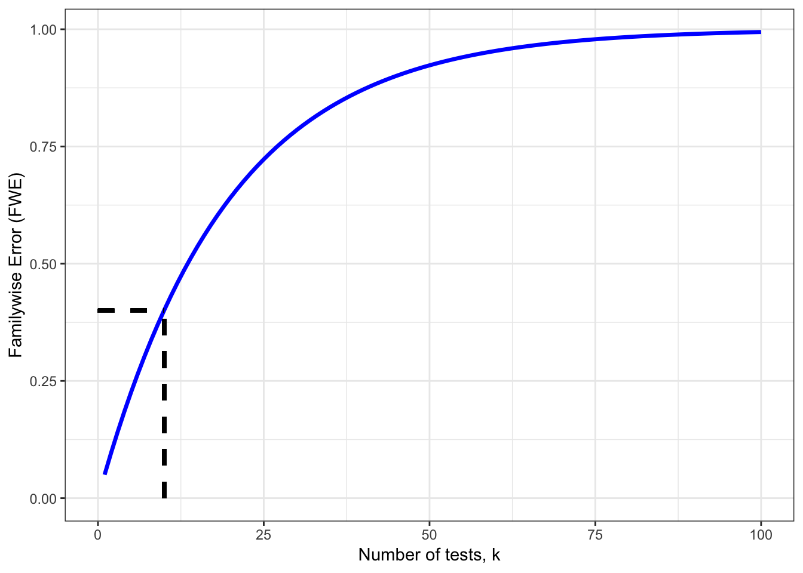
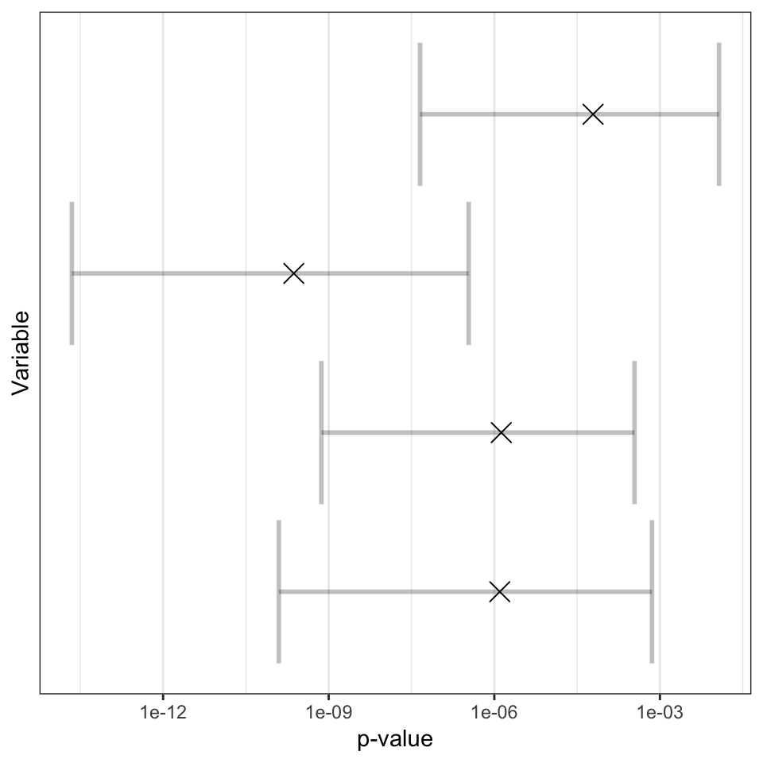

---
output:
  pdf_document: default
  html_document: default
---

# False positives and false negatives: are we missing true effects?

The aim of many research studies is to investigate whether there is evidence for a specific hypothesis. We typically want to test this hypothesis in a robust way that gives us a clear indication of evidence for or against. Study design is paramount in ensuring that we can trust our results and have confidence in any inferences drawn. The implications of poor study design are not easily visible as many statistical tests will generate results regardless of whether certain test assumptions are met, or if we are using a small sample. This failure to meet certain assumptions or using an insufficient sample size can lead to an increase in false positives, also known as a Type I errors ($\alpha$), or an increase in false negatives, also known as Type II errors ($\beta$). Some more formal definitions with examples will help us to clarify these concepts.

### Type I error ($\alpha$)

**A false positive occurs when the Null hypothesis is rejected and a true effect is not actually present.** Typically, the type I error rate is controlled by setting the "significance criterion" at 5% or sometimes more conservatively 1%. In real terms, this would indicate that if $\alpha=0.05$ and a true effect is not present, we would expect 1 in 20 results to be statistically significant but in fact this will have occurred by chance alone. 

For example, Researcher X wants to test the hypothesis that eating carrots improves children's IQ by 2 points. The researcher assigns 6 children to two groups, one group eat carrots and the other group eat their usual snack. The data is collected and a significant finding is found (Null hypothesis that carrots do not cause a 2 point increase in IQ is rejected). The researcher is jubilant that he has discovered an interesting result for publication. 

His sceptical colleague decides to check this result and decides to try to replicate the finding. The colleague re-runs the study with a new sample of children, but does not alter any other details of the study. Unfortunately, the colleague does not replicate the finding. The first result is likely to be a false positive for a number of reasons including sampling variability in small samples, small effect size, or even just poor quality data.    

### Type II error ($\beta$)

**A false negative occurs when the Null hypothesis is accepted and a true effect is actually present.**

Now consider a second example, where the sceptical colleague wants to test a well-established and frequently-replicated result. she wants to confirm whether on average children who read more frequently obtain better exam results when they are tested on vocabulary. Once again, 6 different children are split into two groups, one group reads with a parent each night for a month and the other group continues with their usual routine. The study is run and the Null hypothesis is accepted as the statistical test results in a non-significant p-value (P>=0.05, in this case). 

The sceptical colleague is confused as she cannot replicate a known effect, but there is overwhelming evidence to indicate that an effect should be present. We look to the study design and oncemore, we see that the sample size was small and sampling variability will have played some role in causing a type II error. 

  
<table class="table table-striped table-bordered" style="width: auto !important; margin-left: auto; margin-right: auto;">
<caption>(\#tab:confusionMat)Confusion Matrix for binary test</caption>
 <thead>
<tr>
<th style="border-bottom:hidden" colspan="1"></th>
<th style="border-bottom:hidden" colspan="1"></th>
<th style="border-bottom:hidden; padding-bottom:0; padding-left:3px;padding-right:3px;text-align: center; " colspan="2">
True
</th>
</tr>
  <tr>
   <th style="text-align:center;">  </th>
   <th style="text-align:center;">  </th>
   <th style="text-align:center;"> Condition positive </th>
   <th style="text-align:center;"> Condition negative </th>
  </tr>
 </thead>
<tbody>
  <tr>
   <td style="text-align:center;font-weight: bold;width: 9em; "> Predicted </td>
   <td style="text-align:center;font-weight: bold;width: 9em; "> Predicted Positive </td>
   <td style="text-align:center;width: 9em; "> True Positive 
 POWER </td>
   <td style="text-align:center;width: 9em; "> False Positive 
 Type I error </td>
  </tr>
  <tr>
   <td style="text-align:center;font-weight: bold;width: 9em; "> Predicted </td>
   <td style="text-align:center;font-weight: bold;width: 9em; "> Predicted Negative </td>
   <td style="text-align:center;width: 9em; "> False Negative 
 Type II error </td>
   <td style="text-align:center;width: 9em; "> True Negative </td>
  </tr>
</tbody>
</table>
Table \@ref(tab:confusionMat) presents a contingency table of the potential combinations of test or predicted condition and true condition. This is a common representation of the classifications of power, false positive, false negative, and true negative for a binary test classifier.

## Statistical power
As we have seen in our earlier examples, a frequent concern in study design refers to sample size and it's related concept of statistical power. Power can be defined as the probability that some statistical test will reject the Null hypothesis given that an alternative hypothesis of interest is true. 

Consider the following example, we want to investigate whether there is a significant difference in mean scores between two groups, perhaps an intervention and a control group. The indivduals are randomly assigned to each group and for simplicity we assume that there are no additional differences between the groups. The intervention is administered and we collect data on all individuals before running our statistical analysis. The power is then a function of several quantities:

- Sample size
- "Significance criterion", also known as the Type 1 error rate ($\alpha$)
- Size of the effect of interest 
- Type II error ($\beta$, note that Power=1-$\beta$)

We can show the relation between these quantities of interest visually through an example using the z-test which is a simple one sample location test. The idea of this test is to assess whether a sample of some quantity of interest has the same sample mean as the population of the same quantity. In the figures below we will use a one-sided z test, which indicates that we have a direction specific hypothesis and is one of the simplest tests to introduce these concepts. A side note, two sided tests are more common in practice due to the fact that it is more realistic to test for a difference regardless of direction of effect.

The first figure \@ref(fig:densplot) shows the case for a single individual, n=1. We have set the standard deviation of both Null and Alternative distributions to equal one, and their means to zero and one respectively. When we have a sample size of 1 individual, we see that a small area is defined for power, indicating lower power and higher Type II error.   

(\#fig:densplot)Z test: statistical power, N=1

The second figure \@ref(fig:densplot2) presents the same one-sided z test but here the sample size has increased. We should notice that two things have appeared to change. Firstly, we see a greater distinction between the two distributions. Secondly, we see that the critical $z$ value (vertical dashed line) has changed location. The distributions have not changed their location (peak of each bell shaped curve), but the spread of each distribution has shrunk as a result of the sample size as the spread is directly proportional to the sample size. The reason for this change lies in the formula for the standard error and $Z$ score test statistic itself, 

$SE = \frac{SD}{\sqrt(n)}$, where $n$ is the sample size, and $SD$ is the standard deviation.

The $z$ value or score is also proportional to the sample size, so we see that this value changes accordling. The $z$ score is defined as follows,

$z =\frac{M-\mu}{SE}$, where $M$ is the sample mean score, $\mu$ is the population mean, and $SE$ is as defined above.

The shaded areas on the density plots directly relates to the concepts outlined above: power, type I, and type II errors. When the sample size increases, the standard error (SE) and $z$ score both reduce. The only input parameter that has changed between the two figures is that the power has increased. We notice that the type I error rate (area in red) is proportionally the same at 5% and the effect size remains fixed, so we see a change in the only two remaining quantities, power and type II rate. This is because these quantities are linked. The area under the density curve must always remain at 1, so proportionally, we can calculate the power as 1-(type II rate, $\beta$) and vice versa. We can visually see this in both figures by looking at the specified areas for the alternative distribution.  
  

(\#fig:densplot2)Z test: statistical power, N=10

An important point to note is that each of the following elements: power, sample size, effect size, and type I and II errors are intertwinned with each other. Hence, if one element is changed this has some effect on the other quantities. It also gives an insight on how we can use this knowledge to design our studies to minimise type I and II errors and increase statistical power. 

Typically, clinical trials in medicine will design studies to achieve 80% statistical power and depending on the statistical analysis strategy, will employ some method to control type I error rate or use a more conservative rate (traditionally in NHST $\alpha=0.05$). Fixing these two quantities leaves us with a smaller number of elements to vary, but ususally we are designing to answer a particular scientific question which will also provide theoretical constraints. More specifically, an effect size of interest will be dictated ideally from a meta-analysed estimate of the effect size, or designed to the smallest effect size of interest that is practically or clinically meaningful. This leaves us with sample size as our only remaining element. 

A power calculation will vary sample sizes for a specific statistical analysiswhilst keeping statistical power, type I error rate, and effect size of interest at constant values. Sample size is usually most influenced by the size of effect and researcher constraints, i.e. funding or time. A large effect size will require fewer unique observations and conversely, smaller effect sizes require very large samples. The logic behind this can be seen in figure \@ref(fig:densplot2), if we increase the effect size, the central tendencies (mean) of each distribution diverge, so the overlap of the distributions becomes less, provided that the standard errors remains unchanged. 

## Multiple hypothesis testing
Even when we have a well-designed and adequately powered study, if we collect multiple outcome variables or if we are applying multiple tests to the same data, then the outcomes are unlikely to be completely independent, so we increase our change of finding a false positive. Returning to the idea that we have a type I error rate for a single test at 5%, then suppose we apply $k$ tests to our data. We increase our false positive rate dramatically for the set of tests, officially known as the family-wise error rate (FWER). The new significance level is given by $1-(1-\alpha)^{k}$ (i.e. the probability of finding at least one false positive). If we assumed that we have performed 10 tests (k=10), we have increased our chance of obtaining a false positive to approximately 40%.

(\#fig:FWER)Plot of relationship between familywse error rate and number of statistical tests

Figure \@ref(fig:FWER) shows the relationship between the familywise error rate and the number of tests administered to the data. Clearly, the more tests applied leads to significant increase in the chance of at least one false positive result. There are many different ways to adjust for the multiple testing in practice. We shall discuss some of the most commonly applied.

### Bonferroni Correction
The Bonferroni correction is both the simplest and most popular adjustment for multiple testing to protect the type I error rate. The correction works by dividing the type I error by the number of tests conducted. 

For example, say we had some data and wanted to run multiple t-tests between two groups on 10 outcomes which all measure a similar effect of interest. The Bonferroni correction would adjusted the $\alpha$ level to be 0.05/10 = 0.005, which would indicate that the critical $\alpha$ would be $1-(1-\alpha_{adjusted})^{n} = 1-(1-0.005)^{10} = 0.04888987$ which is approximately close to our original $\alpha$ as required, so we have successfully controlled our type I errors at approximately 5%.

Bonferroni is widely used due to its simplicity but it has the consequence that it can be overly conservative. We say that a test is overly conservative if we over correct in some cases which increases our type II errors and reduces our statistical power. This is often the case when we have some dependency between the outcomes

### False Discovery rate (FDR)
The false discovery rate differs from the Bonferroni as the correction controls the expected proportion of false positives rather than all false positives.

$FDR = \frac{False\ positive}{False\ positive\ +\ True\ positive}$

We will present two common techniques for FDR procedure, Benjamini-Hochberg (BH), and Benjamini-Yekutieli (BY). The BH procedure can be summarized into four steps:

1. Sort a set of p-values from a set of multiple comparisons into ascending order.
2. For each p-value, assign a rank. For example, the first p-value could be 1 and the second would be 2, and so on.
3. Next we need to calculate a BH critical value for each p-value. We use the formula, $(i/n)\alpha$, where $i$ is a particular p-value's rank; and $n$ is the number of tests.
4. Original p-values are now compared against the BH critical values (3), finding the largest p-value that is smaller than the critical value.

We can solidify this procedure by looking at an example. Consider again that we revisit the set of t-tests from our Bonferroni correction. We are sure that the correction is overly conservative as some of the test are moderately correlated with each other. 

<table class="table table-striped table-condensed" style="width: auto !important; margin-left: auto; margin-right: auto;">
<caption>(\#tab:BYexample)Corrected p-values using several different methods (Bonferroni, BH, BY)</caption>
 <thead>
  <tr>
   <th style="text-align:center;"> Variable </th>
   <th style="text-align:center;"> Rank </th>
   <th style="text-align:center;"> alpha </th>
   <th style="text-align:center;"> p.value </th>
   <th style="text-align:center;"> BH </th>
   <th style="text-align:center;"> BY </th>
  </tr>
 </thead>
<tbody>
  <tr>
   <td style="text-align:center;"> X1 </td>
   <td style="text-align:center;"> 1 </td>
   <td style="text-align:center;"> 0.05 </td>
   <td style="text-align:center;"> 0.002 </td>
   <td style="text-align:center;"> 0.005 </td>
   <td style="text-align:center;"> 0.005 </td>
  </tr>
  <tr>
   <td style="text-align:center;"> X2 </td>
   <td style="text-align:center;"> 2 </td>
   <td style="text-align:center;"> 0.05 </td>
   <td style="text-align:center;"> 0.004 </td>
   <td style="text-align:center;"> 0.01 </td>
   <td style="text-align:center;"> 0.007 </td>
  </tr>
  <tr>
   <td style="text-align:center;"> X3 </td>
   <td style="text-align:center;"> 3 </td>
   <td style="text-align:center;"> 0.05 </td>
   <td style="text-align:center;"> 0.008 </td>
   <td style="text-align:center;"> 0.015 </td>
   <td style="text-align:center;"> 0.008 </td>
  </tr>
  <tr>
   <td style="text-align:center;"> X4 </td>
   <td style="text-align:center;"> 4 </td>
   <td style="text-align:center;"> 0.05 </td>
   <td style="text-align:center;"> 0.012 </td>
   <td style="text-align:center;"> 0.02 </td>
   <td style="text-align:center;"> 0.01 </td>
  </tr>
  <tr>
   <td style="text-align:center;"> X5 </td>
   <td style="text-align:center;"> 5 </td>
   <td style="text-align:center;"> 0.05 </td>
   <td style="text-align:center;"> 0.023 </td>
   <td style="text-align:center;"> 0.025 </td>
   <td style="text-align:center;"> 0.011 </td>
  </tr>
  <tr>
   <td style="text-align:center;"> X6 </td>
   <td style="text-align:center;"> 6 </td>
   <td style="text-align:center;"> 0.05 </td>
   <td style="text-align:center;"> 0.041 </td>
   <td style="text-align:center;"> 0.03 </td>
   <td style="text-align:center;"> 0.012 </td>
  </tr>
  <tr>
   <td style="text-align:center;"> X7 </td>
   <td style="text-align:center;"> 7 </td>
   <td style="text-align:center;"> 0.05 </td>
   <td style="text-align:center;"> 0.054 </td>
   <td style="text-align:center;"> 0.035 </td>
   <td style="text-align:center;"> 0.013 </td>
  </tr>
  <tr>
   <td style="text-align:center;"> X8 </td>
   <td style="text-align:center;"> 8 </td>
   <td style="text-align:center;"> 0.05 </td>
   <td style="text-align:center;"> 0.091 </td>
   <td style="text-align:center;"> 0.04 </td>
   <td style="text-align:center;"> 0.015 </td>
  </tr>
  <tr>
   <td style="text-align:center;"> X9 </td>
   <td style="text-align:center;"> 9 </td>
   <td style="text-align:center;"> 0.05 </td>
   <td style="text-align:center;"> 0.12 </td>
   <td style="text-align:center;"> 0.045 </td>
   <td style="text-align:center;"> 0.016 </td>
  </tr>
  <tr>
   <td style="text-align:center;"> X10 </td>
   <td style="text-align:center;"> 10 </td>
   <td style="text-align:center;"> 0.05 </td>
   <td style="text-align:center;"> 0.2 </td>
   <td style="text-align:center;"> 0.05 </td>
   <td style="text-align:center;"> 0.017 </td>
  </tr>
</tbody>
</table>

Table \@ref(tab:BYexample) shows the p values obtained from 10 t-tests on data obtained from the same subjects but different outcome measures. If we considered the p values are sufficiently indpendent, we could conclude that the first six variables(x1-x6) are statistically significant, but on further inspection and deciding to correct using the BH procedure, we find that the we find only X1-X4 are statistically significant under a more robust FWER (green coloured cells). Had we chosen the more conservative Bonferroni correction, we would only find X1 and X2 remain statistically siginficant ($\alpha_{Bonf}=0.05/10=0.005$, blue coloured cells).

The second method that controls the False discovery rate is the Benjamini-Yekutieli (BY), which is a more conservative correction but allows for dependence between the tests (i.e. the tests are correlated; therefore, the p-values will also be correlated). The adjustment resemmbles the BH procedure with an additional constraint,

$(i/n)(\frac{\alpha}{\sum_{i=1}^{k} 1/i})$

Table \@ref(tab:BY_example) shows the p values that remain statistically significant under the Benjamini-Yekutieli adjustment (coloured in red). In our example, the BY is more conservative than the BH but is less conservative than the Bonferroni.

### Permutation methods
Resampling techniques offer a new perspective on correcting for multiple testing as the basis is not according to adjusted p-values. If we recall in \@ref(fig:densplot), we have a null distribution which is crucial for obtaining our test statistic. The permutations approach creates an empirical estimate of this null distribution by re-sampling, say $M$ times, the total number of observations, in a population sample. The benefit of this approach is that the statistical significance is estimated from the data. This also has the added benefit that properties of the data including irregularities are carried through in the permuted data sets. The general procedure is as follows:

1. Using the original data set, a test statistic and corresponding p-value are calculated. 
2. Next, the data are permuted (resampled), so we obtain a jumbled sample of the original data set but with the allowance of resampling with replacement. Using this new permutated sample data, we calculate the test statistic and associated p-value. 
3. Step (2.) is then repeated $M$ times (typically, >1000 repetitions), and each time the test statistic and p-value are recorded to form empirical distribution of the test statistic.
4. The permuted distribution is then calculated as the frequency of $M$ permutations that the original data test statistic is smaller than each permuted test statistic, then dividing this frequency by $M$, the number of permuted iterations. 

The same statistical test is used according to the original design, but this test is fitted multiple times. The permutations randomly sample values from each group, as the observations from each group are considered as exchangeable. The assumption in the independent groups test is that the level of significance is not dependent on particular pairings of observations from each group.

(\#fig:permutations_test)Permutation distributions for individual tests

Suppose we have two groups of individuals and have measured language performance using three different instruments. We choose to use the Student's two independent samples t-test sequentially to test for differences between the two groups of individuals on each of the three measures. We have chosen not to use a correction that adjusts the p-values, instead we decide that a permutation approach will be more robust. Figure \@ref(fig:permutation_test) shows the result of our analysis using the permutation corrected t-tests. The cross points are the actual p-values of the t-tests on the original data. The 95% confidence intervals are constructed from the permuted distributions.
