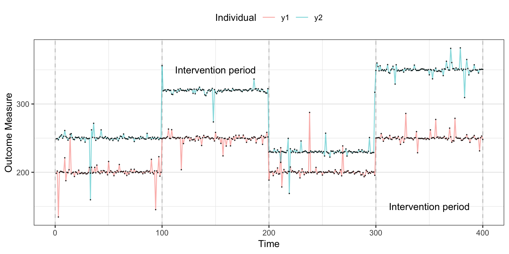
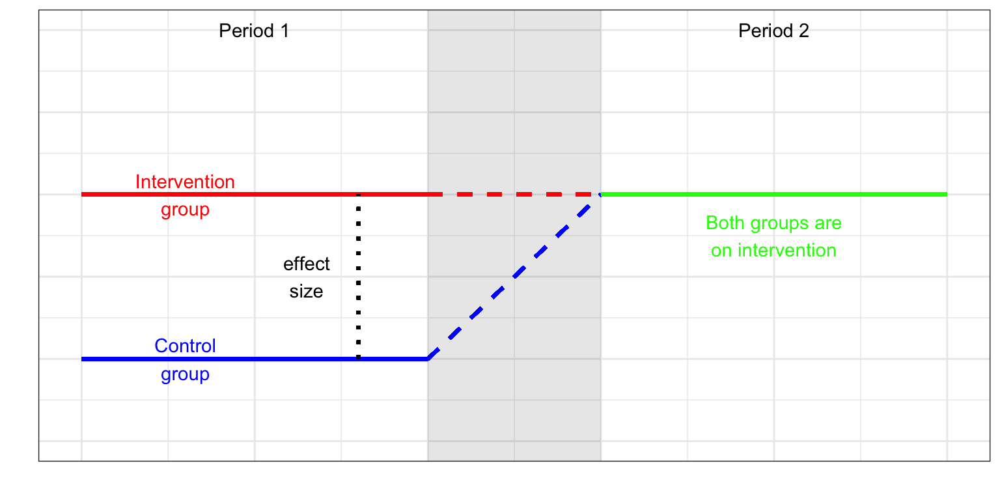

#	Special cases of the RCT: within-subject designs

## Single case designs

The single case design, also known as N-of-1 trials, or small N design (minor wording variations are also common), is a commonly used intervention design in clinical psychology. Its origins can be traced back to the late 1940s [@Krasny_2018] and its purpose is to test an intervention using only a small number of individuals (typically, 2-5 individuals). The interventions collect repeated measurements on the individuals and depending on the designs will sequentially introduce and remove an intervention at random to assess it is a useful treatment. Specific methods of data analysis have been developed to allow for the small number of individuals, crucially relying on the number of repeated measures. 

Statistical analysis tends to focus on: i) visual assessment by plot the sequential series of observed data and highlighting on-off periods of intervention; ii) Time series analysis [@Chatfield_2004], or iii) simple and commonly-used inferential statistics tests [@Tate_2016].

(\#fig:SingleCaseDplot)plot showing a single case design RCT (N=2)

When a single case design won't work [@Senn_2004]

<!--The CENT reporting guidelines [67], [68] are intended for medical N-of-1 trials, the SCRIBE 2016 guidelines [22], [51] are intended for SCEDs in the behavioral sciences --> 

## Cross-over designs

We describe the crossover design as a special case of the RCT as we have both a control and treatment group but we have the variation that both control and intervention groups receive both conditions but in reverse orders to each other. Possible outcomes of such a study are shown in Figure x. The pattern seen in panel 1 is unlikely for an intervention that is intended to produce long-lasting effects – in SLT practice, it would not be expected that skills would decline after an effective intervention had been withdrawn. 

<table class="table table-striped table-bordered" style="width: auto !important; margin-left: auto; margin-right: auto;">
<caption>(\#tab:crossovertable)Treatment Allocation Matrix</caption>
 <thead>
  <tr>
   <th style="text-align:left;">   </th>
   <th style="text-align:center;"> Period 1 </th>
   <th style="text-align:center;"> Period 2 </th>
  </tr>
 </thead>
<tbody>
  <tr>
   <td style="text-align:left;font-weight: bold;"> Group 1 </td>
   <td style="text-align:center;"> A </td>
   <td style="text-align:center;"> B </td>
  </tr>
  <tr>
   <td style="text-align:left;font-weight: bold;"> Group 2 </td>
   <td style="text-align:center;"> B </td>
   <td style="text-align:center;"> A </td>
  </tr>
</tbody>
</table>

### Traditional cross-over design

The benefit of the crossover design is that a potentially more accurate evaluation of intervention comparison is achieved as we compare individuals to themselves rather than controls that are different individuals. A secondary benefit is that crossover designs typically require fewer individuals as a separate control group is not necessary. 
A crossover design is split into three phases, an initial phase where two groups are randomized (exactly the same as a parallel group design) to intervention and control. Once the first phase has ellapse, the individuals enter a washout phase, this is important to allow any intervention effect to be removed before the groups are switched and phase two initiates, so that both groups have received intervention. The assessment of the intervention looks at the differences between phases 1 and 3 by group. We hope to see no group difference but a significant phase difference.

(\#fig:crossoverplot)Plot showing a crossover design RCT

### Delayed crossover design (Wait list controls)

The delayed crossover design or wait list control design is another type of within subject design. The control group also receive the intervention but after a pre-specified wait period. This design benefits from an ethical point-of-view as all subjects have access to a potentially beneficial intervention and sevea as their own controls. There is, however, some debate around usefulness of wait-list designs in the psychological and behavioural interventions literature [@Elliott_2002; @Cunningham_2013; @Furukawa_2014]. In particular, @Cunningham_2013 presents results from a study that showed this design can potentially, artificially inflate intervention effect estimates. The design's main issue is the wait period itself. In particular, this is a problem if the controls are made aware that they are the control group. When a participant knows that they have to wait, psychologically this can induce different behaviour.  

(\#fig:waitlist_plot)Plot showing a wait list design RCT

 
