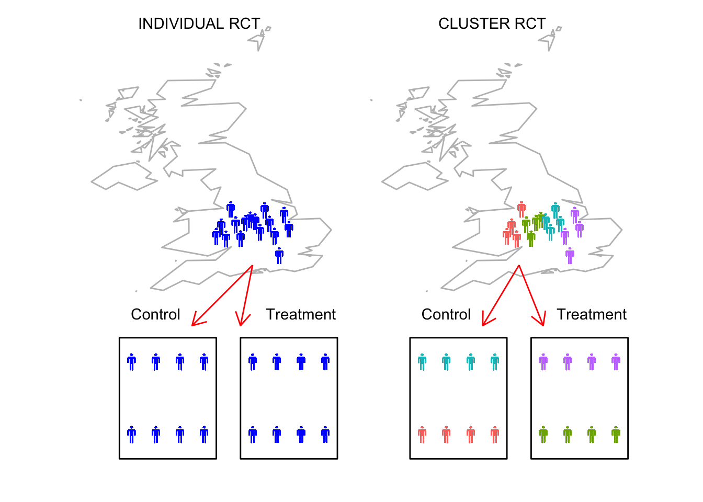

# Cluster Randomised Control Trials

## What is a cluster RCT? 

In some situations, allocation of intervention can be problematic due to pragmatic constraints; for example, schools can find spliting students within each class into an intervention and control groups to be very disruptive; or perhaps therapists may find it difficult to assign individuals to intervention following a preset scheme as the intervention may be very obviously different compared to control, so randomisation can be compromised (in many medical clinical trials, randomisation can be simpler due to the use of blinding because placebo treatments can be designed to appear identical). A potential solution is to use cluster trials as the allocation to intervention is performed at the group level, typically referred to as clusters. We can designate clusters that would naturally form together, for example, school classes, patients under the care of a particular medical practice or a specific therapist, or perhaps by geographic location (county, district or NHS trust).

## Advantages and disadvantages of cluster design

The cluster design is primarily used when it is problematic to randomise treatments at the individual level. The clustered approach while solving one issue introduces a second second as a consequence. The individual units are now dependent rather than independent as those receiving a particular intervention arm can exert an influence on each other. If we return to an earlier example from the previous chapter, school-based reading interventions for dyslexic children aged 9-11, one computer game based and one phonics-based. We can explore some of the advantages and disadvantages of the cluster design in this case:

### Advantages

- Avoids pragmatic issues of randomising to intervention within established natural clusters, i.e. splitting classes in schools to different intervention arms.  
- Ability to control or avoid 'contamination' effects.   
- Essential if the intervention can only be delivered at the group level, i.e. resource constraints in a school does not permit splitting classes as there are not enough teachers.

### Disadvantages

- Requires larger sample sizes.
- More sophisticated statistical analyses are required to deal with the dependency among individuals within the same clusters. 
- can be much less efficient than individual randomised designs.

## logistical and pragmatic constraints

Often interventions that are focused at a community or group level cannot be randomised at the individual level in any practical way. This is particularly apparent when trying to administer interventions in schools that are not focused on particular subgroups of children, i.e. reading intervention to improve literacy skills in 6 year  olds. If the intervention requires training of those administering the intervention, there may be resource constraints on how many individuals can be trained. Using clusters, less individuals would need to be trained as not every administrator would provide intervention and control only one or the other.

## Contamination

A major consideration in randomised trials is their ability to distinguish a reliable size of effect between control and intervention conditions in a study. Contamination in the context of controlled trials means that individuals in one arm of the trial, say control arm, have been exposed to the another arm of the trial, say intervention.For example, a child on control arm is disatisfied as they see their friend on interesting intervention arm, so adopts some of the intervention practices themselves which attenuates any treatment effect, i.e. the difference between control and intervention groups. 

In medical trials, we can control contamination by blinding the randomisation and matching placebo treatments appearance to the intervention. In reality, some community or group level interventions can be difficult to randomise within groups or communities to different trial arms. A second source of contamination can be stem from the practitioner administering the intervention. For example, image that we have recruited several SLPs to administer an intervention at their practice. One set of patientds receive the intervention and the other receive standard practice as a control, but the SLP inadvertantly over time begins to introduce elements of the intervention into standard practice. Therefore, the clustered approach minimises the risk of contamination as intervention clusters are less likely to have direct exposure to each other.

