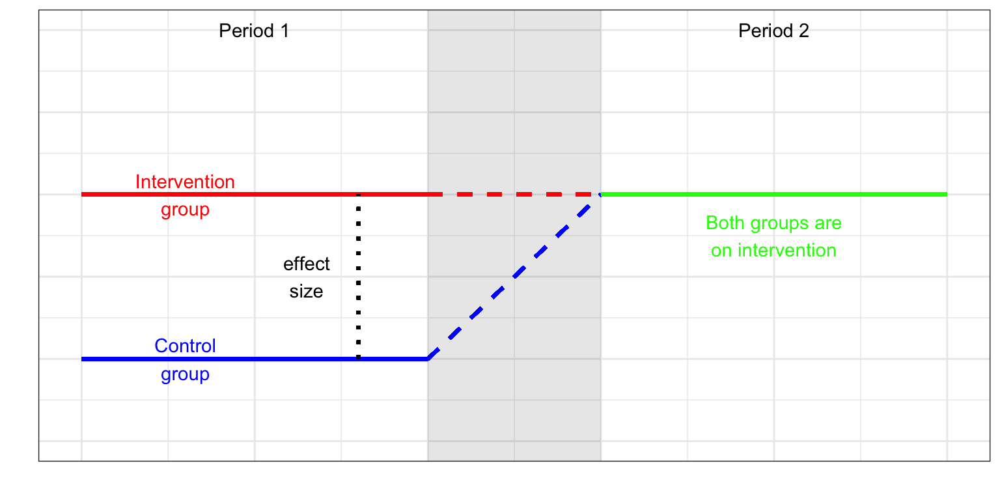
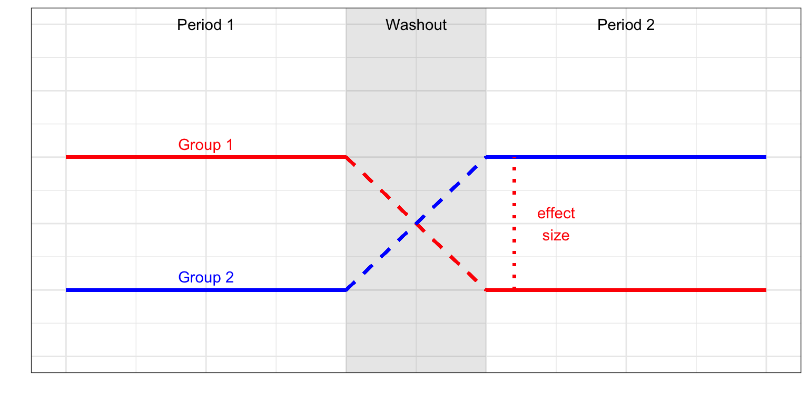

#	Special cases of the RCT: within-subject designs

## Single case designs
When a single case design won't work

## Wait-list controls and cross-over designs

We describe the crossover design as a special case of the RCT as we have both a control and treatment group but we have the variation that both control and intervention groups receive both conditions but in reverse orders to each other. Possible outcomes of such a study are shown in Figure x. The pattern seen in panel 1 is unlikely for an intervention that is intended to produce long-lasting effects – in SLT practice, it would not be expected that skills would decline after an effective intervention had been withdrawn. 

<table class="table table-striped table-bordered" style="width: auto !important; margin-left: auto; margin-right: auto;">
<caption>(\#tab:crossovertable)Treatment Allocation Matrix</caption>
 <thead>
  <tr>
   <th style="text-align:left;">   </th>
   <th style="text-align:center;"> Period 1 </th>
   <th style="text-align:center;"> Period 2 </th>
  </tr>
 </thead>
<tbody>
  <tr>
   <td style="text-align:left;font-weight: bold;"> Group 1 </td>
   <td style="text-align:center;"> A </td>
   <td style="text-align:center;"> B </td>
  </tr>
  <tr>
   <td style="text-align:left;font-weight: bold;"> Group 2 </td>
   <td style="text-align:center;"> B </td>
   <td style="text-align:center;"> A </td>
  </tr>
</tbody>
</table>

### Wait list controls

(\#fig:waitlist_plot)plotting showing a wait list design RCT

 

### Cross-over design

The benefit of the crossover design is that a potentially more accurate evaluation of intervention comparison is achieved as we compare individuals to themselves rather than controls that are different individuals. A secondary benefit is that crossover designs typically require fewer individuals as a separate control group is not necessary. 
A crossover design is split into three phases, an initial phase where two groups are randomized (exactly the same as a parallel group design) to intervention and control. Once the first phase has ellapse, the individuals enter a washout phase, this is important to allow any intervention effect to be removed before the groups are switched and phase two initiates, so that both groups have received intervention. The assessment of the intervention looks at the differences between phases 1 and 3 by group. We hope to see no group difference but a significant phase difference.

(\#fig:crossoverplot)plotting showing a crossover design RCT

