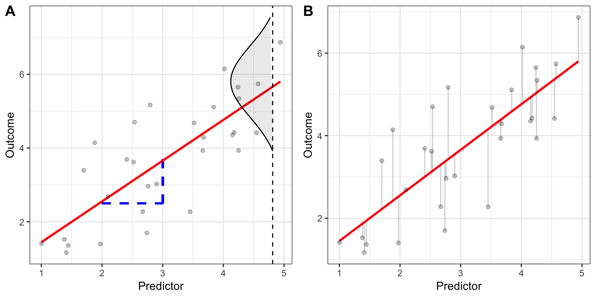
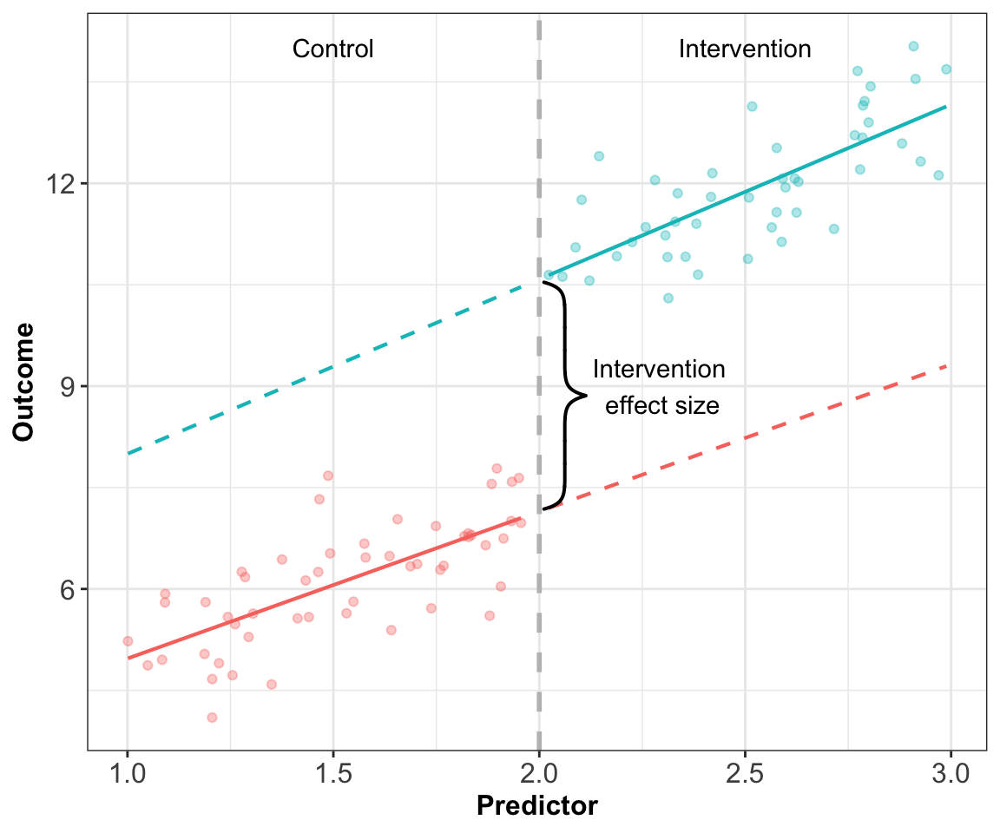
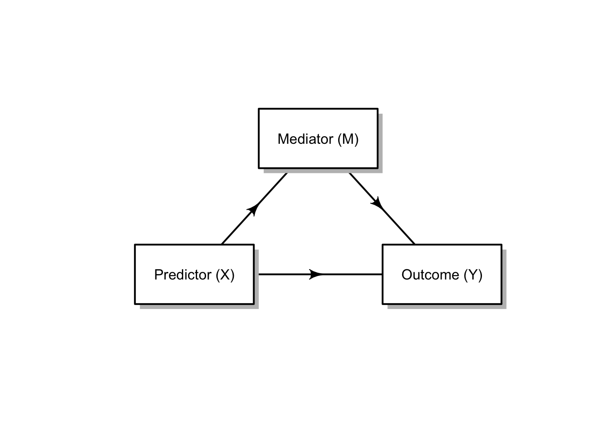
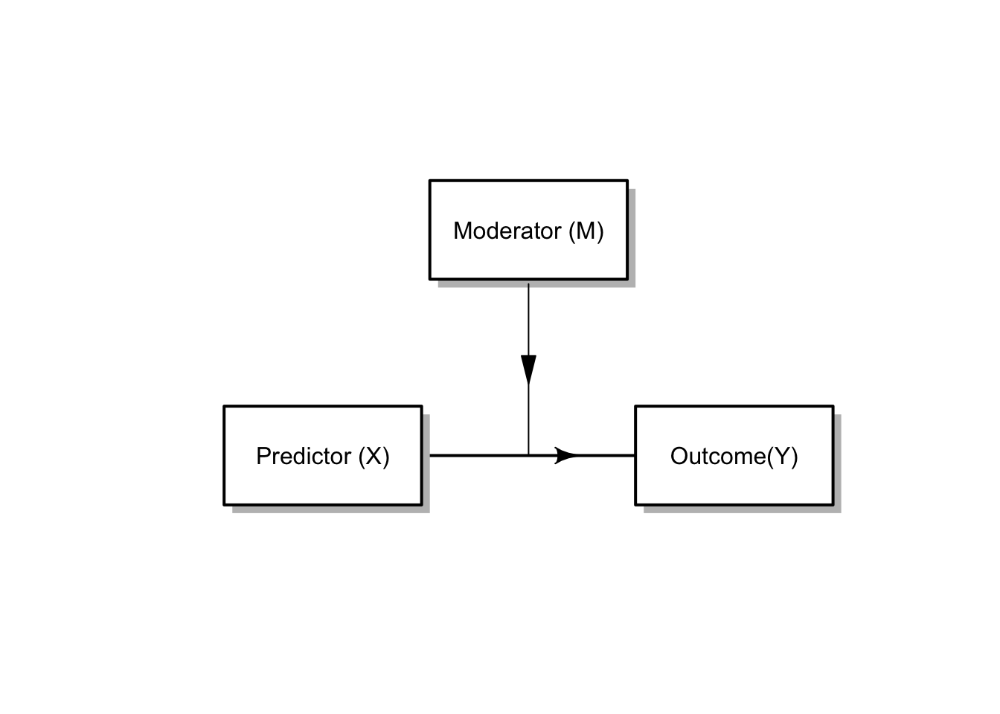
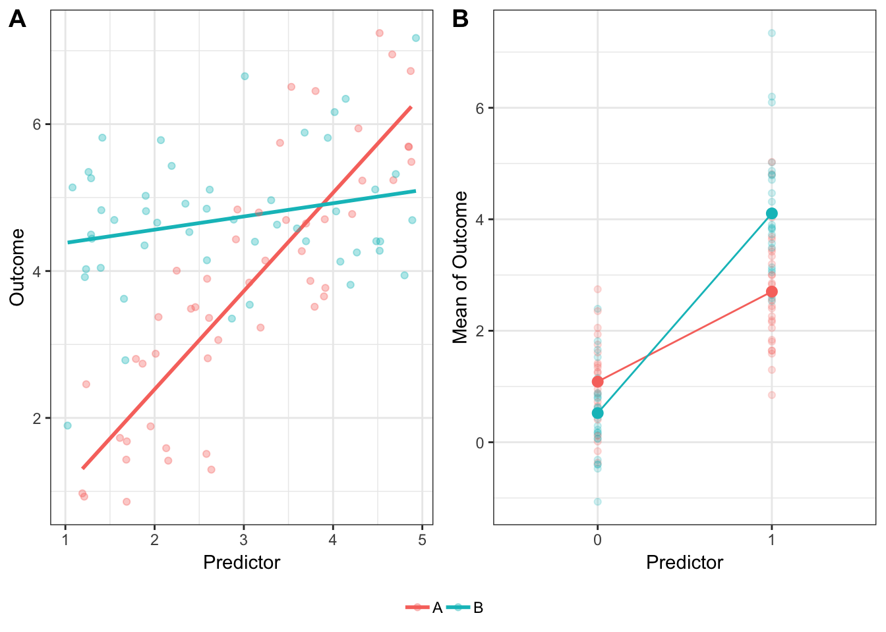

---
output:
  pdf_document: default
  html_document: default
---

#	Regression discontinuity designs

The regression discontinuity follows a quasi-experimental design and is typically used to avoid confounding bias (i.e. when another variable is present that distorts the effect of intervention) when assesssing interventions. It is particularly useful when assignment to intervention is based on some pre-specified threshold from a continuous measure. For example, let us assume that we wish to assess a new reading intervention in a school. Students are assigned to the intervention group according to a general language test. Students that score below a certain threshold are assigned to the intervention group, and rather than discard their peers that scored above the threshold, they form a natural control group. The experimenter is not therefore required to randomly allocate students with poor language scores to the control group when they might benefit from the potential effect of the intervention if it is found to be effective.

Before we delve into the regression discontinuity designs, it may be useful for us to first take a look at general linear models, in particular, ordinary linear regression. Linear models consist of some of the most commonly used methods in applied research including ANOVA, ANCOVA, linear regression, t-tests, F-tests and MANCOVA.

Linear regression's purpose is primarily to understand the straight line relationship that exists for some bivariate data. We assume a causal direction in the relationship unlike correlation as we specify an outcome (dependent) variable and a predictor (independent) variable. The idea being that as we change the value of predictor we see the effect that this has on the outcome variable, by quantifying the relationship according to some statistical model. Figure \@ref(fig:linReg) (A, left) shows some bivariate data which appears to have an underlying linear relationship 

(\#fig:linReg)Linear regression: Plotting residuals, intercept, and slope explainers 

$$Y_{i} = \beta_{0} +  \beta_{1}X_{i,1} + \beta_{2}X_{i,2} + \beta_{3}(X_{i,1} >= c) $$

where 

Statistical issues encountered RDD analysis:

 1. Incorrect specification of regression form ( regression is non-linear or needs a polynomial form)
 2. Misallocation of treatment
 3. Inadequate statistical power (sample size too small)
 4. Limited generalization of effects

(\#fig:linRegDis)Linear regression: Plotting residuals, intercept, and slope explainers 

## Mediators

(\#fig:mediator)Mediator path diagram

## Moderators

(\#fig:moderator)Moderator path diagram

If we return to our linear regression definition from earlier, we have some predictor variable $X$ that has a linear causal relationship with $Y$, i.e. $X$ causes $Y$. Moderation occurs when a third variable is introduced, say $M$ that changes the strength of causal relationship between $X$ and $Y$, hence moderating the relationship.

Figure \@ref(fig:moderator) shows a disgrammatic representation of the moderator effect. The moderator is added into the statistical framework as an interaction. The interaction is added into the regression model formula as an extra variable with a new associated parameter estimate. The extra variable is simple the two interacting terms multiplied together. We can give an exmaple of this by returning to the regression equation that we met earlier. The interaction appears as the multiple of $X_{1}$ and $X_{2}$. 

$$Y_{i} = \beta_{0} +  \beta_{1}X_{i,1} + \beta_{2}X_{i,2} + \beta_{3}(X_{i,1}X_{i,2})$$

We can visual the effect of the interaction much more clearly by looking at some simulated data. Plotting the data, for two types of combinations of variables. Figure \@ref(fig:interaction)A (LEFT) shows the relationship between a nominal Moderator and a continuous predictor. Figure \@ref(fig:interaction)B (RIGHT) shows the relationship between a nominal Moderator and a nominal predictor. 

(\#fig:interaction)Plotting the interaction effect in regression. (A) shows the relation between a nominal Moderator and continuous predictor; (B) shows the relationship between a nominal Moderator and nominal predictor.

