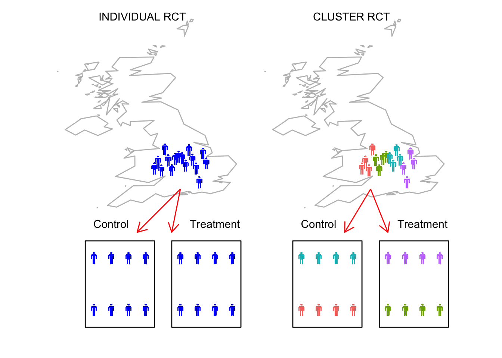

# Cluster Randomised Control Trials

## What is a cluster RCT? 

In some situations, allocation of intervention can be problematic due to pragmatic constraints; for example, schools can find spliting students within each class into an intervention and control groups to be very disruptive; or perhaps therapists may find it difficult to assign individuals to intervention following a preset scheme as the intervention may be very obvious compared to control, so randomisation is compromised (in medical field randomisation is simpler due to using blinding as placebo treatments can be matched to appear identical). A potential solution is to use cluster trials as the allocation to intervention is by group or cluster. We can designate clusters that would naturally form together, for example, school classes, patients under the care of a paticular medical practice, or maybe all patients seen by a specific therapist.

## Advanced design: Stepped-wedge Cluster RCT
